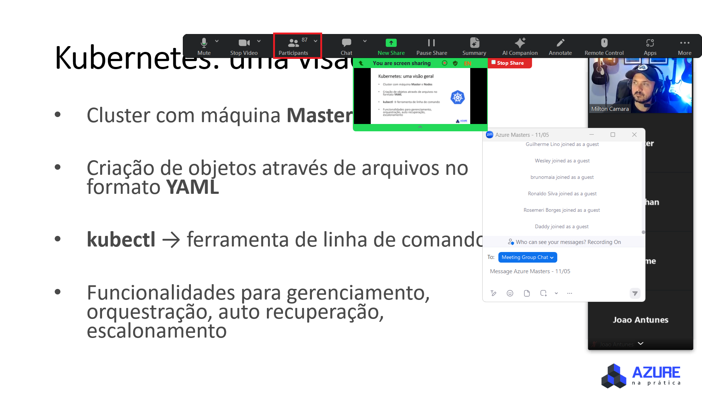
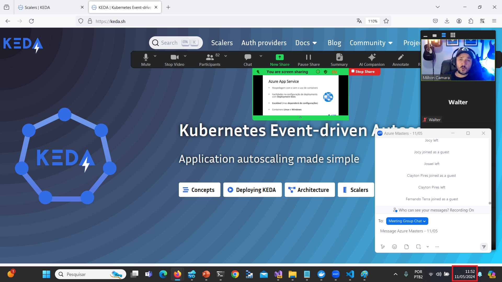
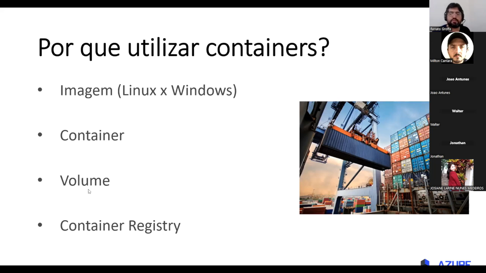
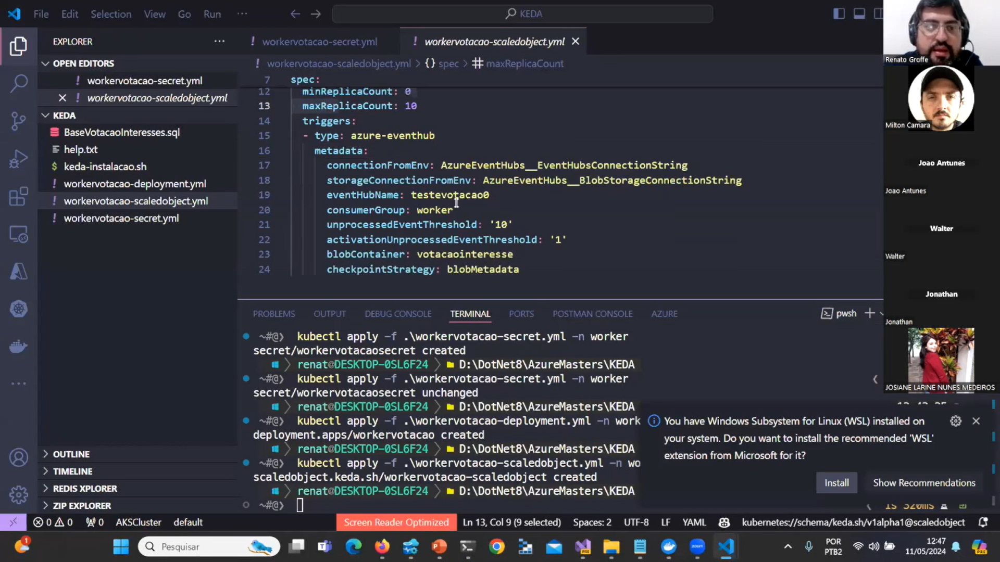
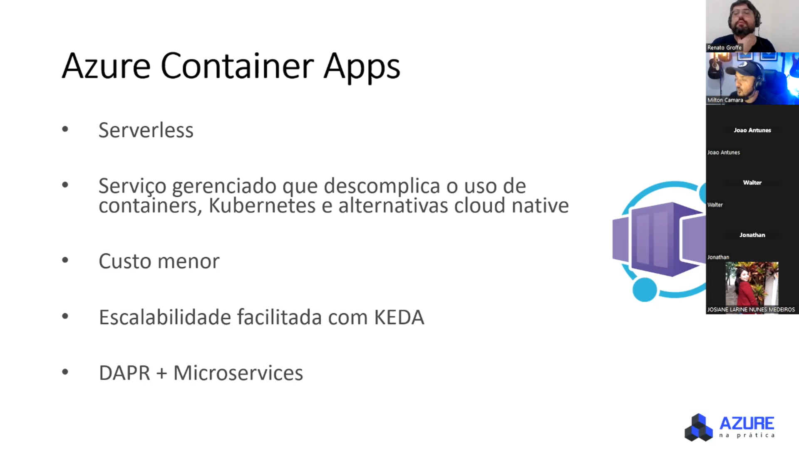
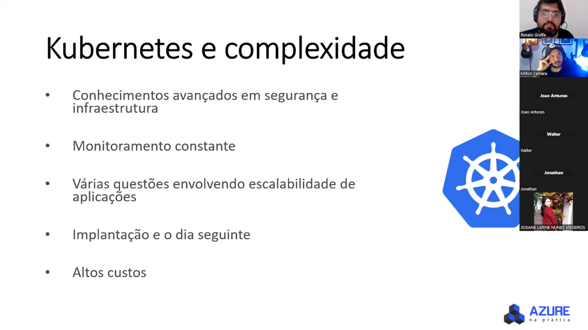
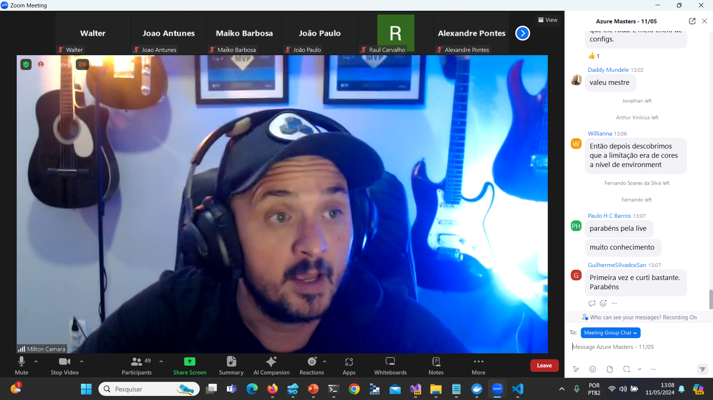

# Azure Masters 05/2024
Conteúdos do evento Azure Masters, promovido pela comunidade Azure na Prática no dia 11/05/2024.

Organizadores:
- **Milton Camara Gomes (Microsoft MVP, MTAC)**
- **Bruno Maia**
- **Renato Groffe (Microsoft MVP, MTAC)**

Apresentações:
1) **Containerização no Azure: serviços, aplicações, arquitetura...**
2) **Azure + Containers na prática**

Palestrantes:
- **Renato Groffe (Microsoft MVP, MTAC)**
- **Milton Camara Gomes (Microsoft MVP, MTAC)**

Número de participantes: **87 pessoas (pico de audiência ao longo da live)**

Tecnologias abordadas: **Docker, Kubernetes, Azure App Service, Azure Functions, Azure Container Apps, Azure Container Instances, Azure Kubernetes Service, Linux, Azure Event Hubs, Application Insights, .NET, ASP.NET Core...**

---

Outros prints podem ser encontrados neste [**diretório**](/img/).

